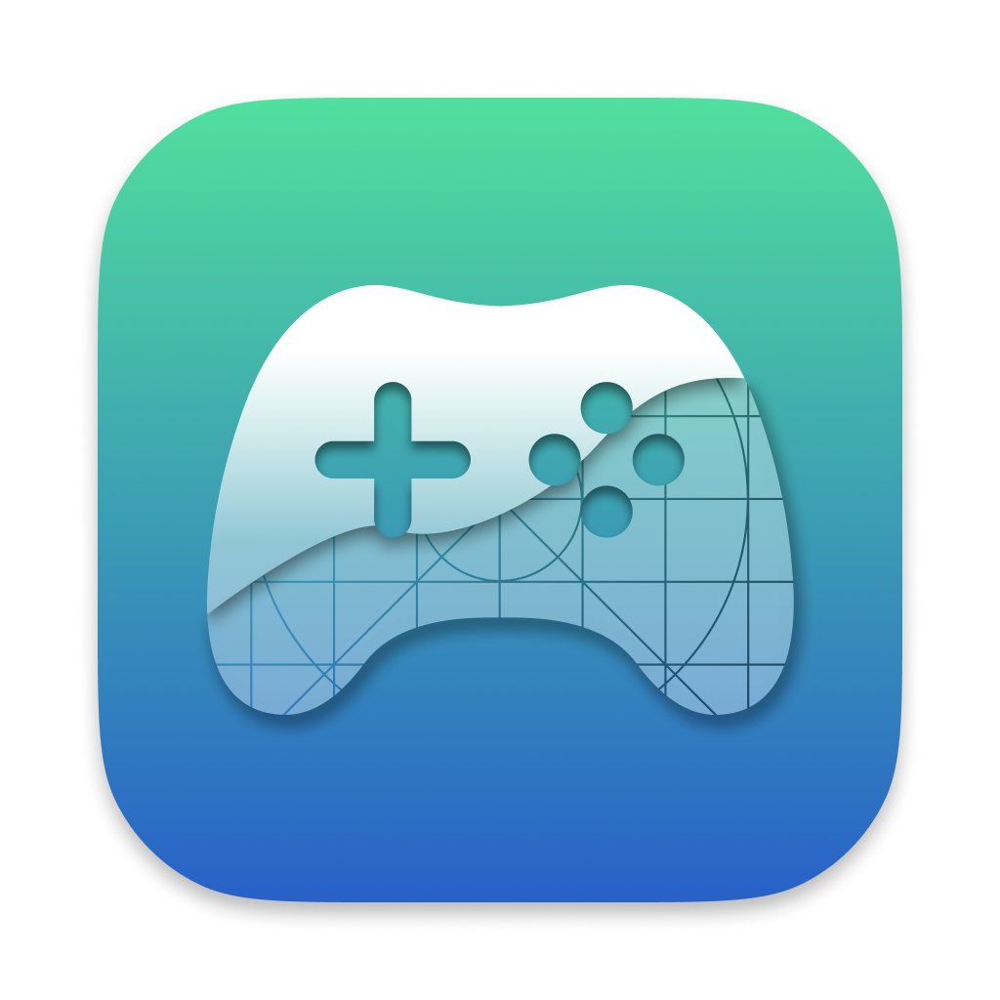

<h1>PlayCover</h1>

  Run iOS apps and games on Apple Silicon Macs with mouse, keyboard and controller support.
   
   
  <a href="https://github.com/PlayCover/PlayCover">GitHub</a>
  ·
  <a href="https://discord.gg/rMv5qxGTGC">Discord</a>
  ·
  <a href="https://playcover.io/">Website</a>

## About The Project

Welcome to PlayCover! This software is all about allowing you to run iOS apps and games on Apple Silicon devices running macOS 12.0 or newer.

PlayCover works by putting applications through a wrapper which imitates an iPad. This allows the apps to run natively and perform very well.

PlayCover also allows you to map custom touch controls to keyboard, which is not possible in alternative sideloading methods such as Sideloadly. 

These controls include all the essentials, from WASD, camera movement, left and right clicks, and individual keymapping, similar to a popular Android emulator’s keymapping system called Bluestacks.

This software was originally designed to run Genshin Impact on your Apple Silicon device, but it can now run a wide range of applications. Unfortunately, not all games are supported, and some may have bugs.

## Contributing

If you have a suggestion that would make this better, please fork the repo and create a pull request. Don't forget to give the project a star! Thanks again!

1. Fork the Project
2. Create your Feature Branch (`git checkout -b feature/AmazingFeature`)
3. Commit your Changes (`git commit -m 'Add some AmazingFeature'`)
4. Push to the Branch (`git push origin feature/AmazingFeature`)
5. Open a Pull Request
