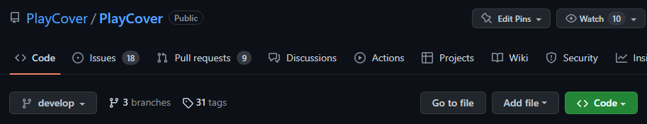

# Building
If you haven't already, follow the instructions in [Install Prerequisites](./install_prerequisites.md).

## 1. Getting the Source

You have a couple of options to go about this:

1. `git clone`
    Open a terminal, and run the following commands:
    ```
    git clone https://github.com/PlayCover/PlayCover.git
    ```

    That will download the code to a PlayCover folder in your current working directory. (If you don't know where that is, run `pwd`).

2. A Git GUI client (Recommended for more serious development)
    Git is a complex program, and a GUI can help you deal it's complexities. A couple of good clients are [Tower](https://www.git-tower.com/) and [GitKraken](https://www.gitkraken.com/).

    We recommend Tower more than GitKraken, but either one is fine. Both are available for free through the [Github Student Developer Pack](https://education.github.com/pack).

    Please refer to your client's documentation for how to clone a repo:

    [Tower docs](https://www.git-tower.com/help/guides/manage-repositories/clone-remote-repository/)

    [GitKraken docs](https://help.gitkraken.com/gitkraken-client/open-clone-init/#cloning-an-existing-project)

3. Downloading a ZIP (discouraged)
    This option is discouraged because it does not download the git repo, only the source. You will not be able to contribute to PlayCover using this option.

    On PlayCover's GitHub Repo, click the green `<>` or `Code` button, located near the bottom right of the screenshot below.

    

    In the sheet that appears, click the "Download ZIP" button near the bottom.

## 2. Apple Developer Account

In order to build PlayCover, you'll need a free Apple Developer Account. Head on over to [developer.apple.com/account](https://developer.apple.com/account) to sign up. (You will use your pre-existing Apple ID).

DO NOT start to enroll in the Apple Developer Program, as that is not required to build PlayCover, and stating to enroll can lock your account for an indeterminate amount of time.

## 3. Adding your Apple ID to Xcode

Open Xcode, and then select `Xcode -> Preferences...` in the menu bar.


In the new window that appears, select the "Accounts" tab, and press the "+" button in the bottom left.


When asked, select to add an "Apple ID"


Then, sign in with your Apple ID like normal.

## 4. Adjusting Signing Settings

Find the `PlayCover.xcodeproj` file, located in the source folder that you downloaded in step 1, and open it in Xcode. A window like the one below should appear.


On the left-hand side, click on the blue "PlayCover" file. The center part of the window should fill with metadata about the project.


In the center view, select the PlayCover application on the left, and then navigate to the "Signing & Capabilities" tab.


Enable the "Automatically Manage Signing" option, and change the current signing team to the signing team with your name.


You may have to repeat the last step for the Release signing settings, if they appear.

## 5. Resolving Package Caches

Sometimes the swift package manager doesn't want to, so you may have to clear the package cache. You can do this by selecting `File -> Swift Package Manager -> Clear Package Cache`.


Then wait for the packages to download. You can see them in the left panel, below all the source files. When they are done, the packages should display a version number beside their name.


## 6. Actually Building the Thing

In the top left corner of the Xcode Project, click on the play button.


Wait a few minutes for PlayCover to build for the first time. If the build is successful, then your custom built version of PlayCover will open automatically. If the build fails, well then you might have skipped a step.

If you get a build error relating to `carthage` or `swiftlint`, make sure that you installed all the prerequisites in [Install Prerequisites](install_prerequisites.md)

If you get a "Cannot find signing team ..." build error, make sure that you followed the [Adjusting Signing Settings](#step-4-adjusting-signing-settings) steps correctly.

If none of those apply to you, then please join our [discord server](https://discord.gg/playcover), and ask for help in `#code-help`.