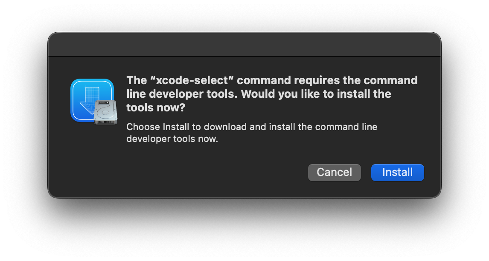

# Alternate Xcode Command Line Tools Installation Methods

If you cannot install the Xcode Command Line Tools from within the app, there are a few alternate methods that you can use to install them.

## Method 1: The command line
1. Open `Terminal.app` (located at `/Applications/Utilities/Terminal.app`)
2. Type `xcode-select --install` and press return
3. In the window that appears, press "Install"

4. Wait for the command line tools to download and install. It should take somewhere around 5-10 minutes, depending in your internet connection. (the estimated time is usually wrong)
5. If you get an error, proceed to method 2

## Method 2: Downloading an install package off of the Apple Developer Website
1. Open the [Apple Developer](https://developer.apple.com/) website in your favorite web browser
2. Click the "Account" button, located in the top right
3. Sign in with your Apple ID
4. If asked, go through the Apple Developer Account setup until you reach a page that looks like the one pictured below. DO NOT START TO JOIN THE APPLE DEVELOPER PROGRAM, doing so will place a lock on your developer account, and you will either have to pay $100 or wait an indeterminate amount of time for your account to be unlocked
5. [Go to this link](https://developer.apple.com/download/all/?q=%22Command%20Line%20Tools%22)
6. Select the correct download, click on more details, and download the .dmg file
    a. If you are running a release version of macOS (non-beta), select the most recent Command line tool file that does not have the words "beta" or "Release Candidate" in its name
    b. If you are running a beta version of macOS, select the most recent file with the word "beta" in it' name.