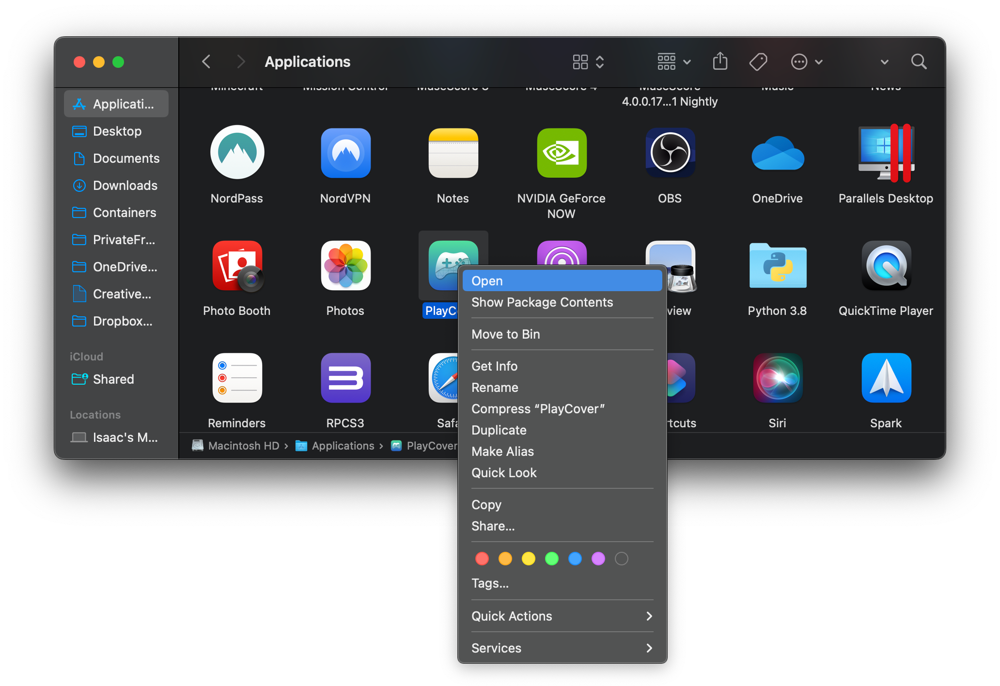

# Download & Install PlayCover

## Prerequisites

PlayCover only works on **Apple Silicon Macs**. The minimum hardware requirement is an Apple M1 chip, but PlayCover will also work on all Apple Silicon chips released after the M1.

If you have an Intel Mac, you can explore alternatives like Bootcamp or emulators.

## Download

You can download the [latest stable release](https://github.com/PlayCover/PlayCover/releases/latest), or build from source by following the instructions below. 

Additionally, you can download the [latest nightly version](https://nightly.link/PlayCover/PlayCover/workflows/2.nightly_release/develop/PlayCover_nightly_210.dmg) to test out experimental features not yet added to the stable release.

>__Note__: The release number in the image may not match the most recent release.

## Installing

- Drag PlayCover into your Applications folder. 

- Then double click to open and click `Open` on the system prompt. 

- When you first run the app you may be met with a screen asking to install `Xcode Command Line Tools`. 
    - Press `Install` in the app
    
    - Authenticate with Touch ID

    

    - Wait for the installation to finish (This make take some time depending on your internet speed)

>__Note__: If the in-app Xcode Command Line Tools install fails, follow the steps listed in [_Alternate Xcode Command Line Tools Installation Methods_](./alt_xcode_cli_install.md).

## Homebrew Cask
We host a [Homebrew](https://brew.sh) tap with the [PlayCover cask](https://github.com/PlayCover/homebrew-playcover/blob/master/Casks/playcover-community.rb). 

To install:
1. Tap `PlayCover/playcover` with `brew tap PlayCover/playcover`;
2. Install PlayCover with `brew install --cask playcover-community`.

To uninstall:
1. Remove PlayCover using `brew uninstall --cask playcover-community`;
2. Untap `PlayCover/playcover` with `brew untap PlayCover/playcover`.

###### This information is up-to-date as of PlayCover 2.0.2
