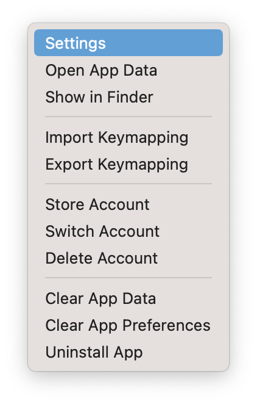
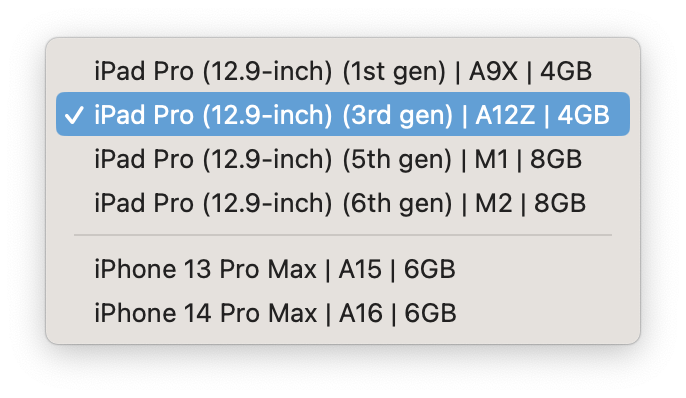
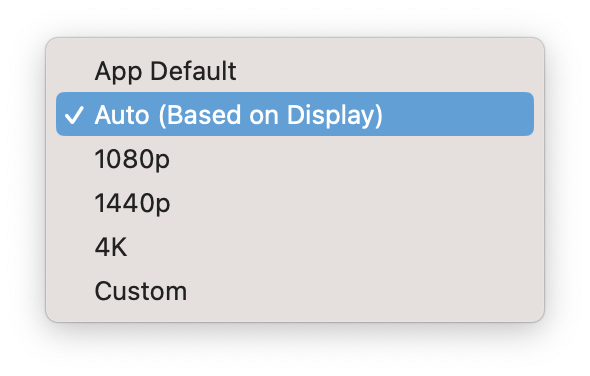

# Migrating

This page contains instructions on how to migrate/update from an older version of PlayCover to version 2.0 and newer. You can check your current version from the menu bar by clicking `PlayCover` > `About PlayCover`

## Versions 1.0.6 to 1.1.1 (Community build)
If you were using one of these versions, you don't need to reinstall your apps and most of your settings/keymapping will be converted. However, some settings could still require a few modifications. Here are a few things that you might want to change. 

You can open the settings by selecting on an app and clicking on the **gear button** on top.  

You can also get to this screen by right clicking on an app and clicking **Settings**.

### Updating your performance settings
If you change your tab to **Graphics** in your app settings, you should see a few options. 

For the best graphical quality, choose `iPad Pro (12.9-inch) (5th gen) | M1 | 8GB` or newer as the iOS device. (Recommended for more powerful computers with active cooling such as MacBook Pro, iMac, Mac mini, and Mac Studio)

For the best performance, choose `iPad Pro (12.9-inch) (3th gen) | A12Z | 4GB` or older as the iOS device. (Recommended for more power efficient laptops with passive cooling such as MacBook Air)

### Updating your resolution settings
You may need to change your resolution depending on what app you are using. **Auto (Based on Display)** works fine for most games, while other apps typically use **App Default** or **Custom**. If you are using a resolution preset such as **1080p**, you might need to choose an aspect ratio that matches your monitor to avoid letterboxing. 

>__Note__: Resolution has a significant impact on graphical quality and performance. Using higher resolutions will improve visuals at the cost of performance, and using lower resolutions will improve performance at the cost of visual quality. 

### Updating your apps
If you installed an app on an older build of PlayCover (before `2.0.0`) and try to update the same app to a newer version on a newer build of PlayCover (`2.0.0` and after), you will encounter an issue where the newer version of the app will fail to replace the older version and two of the same app icons will be present at the same time. 

When this happens, you follow these steps to safely uninstall the older version without losing your logins and data.

1. Go to `Menu Bar` > `PlayCover` > `Settings...` > `Uninstall`
2. Make sure the **Show warning popup** box is checked
3. Go to your **App Library**, select the **list view** instead of icon view
4. You can now see the version numbers of the duplicate apps
5. Click on the older version of the app you want to remove
6. Right click on the app and choose `Uninstall App`
7. When you see the uninstall confirmation popup, **uncheck** every box
8. Click on `Uninstall`

When you open the newer version of the app, your logins and data should now be carried over. 

## Versions 1.0.5 and earlier (Or non-community build)
If you were using one of these versions, you need to reinstall your apps. It is **HIGHLY SUGGESTED** to **NOT** transfer your apps from the old version, as you may run into numerous issues. You can delete the old folder if you want to free up storage at this location: `~/Library/Containers/me.playcover.PlayCover`. You should also perform the steps for 1.0.6 to 1.1.1, as that setup might be useful for you too. 

###### This information is up-to-date as of PlayCover `2.0.3`
