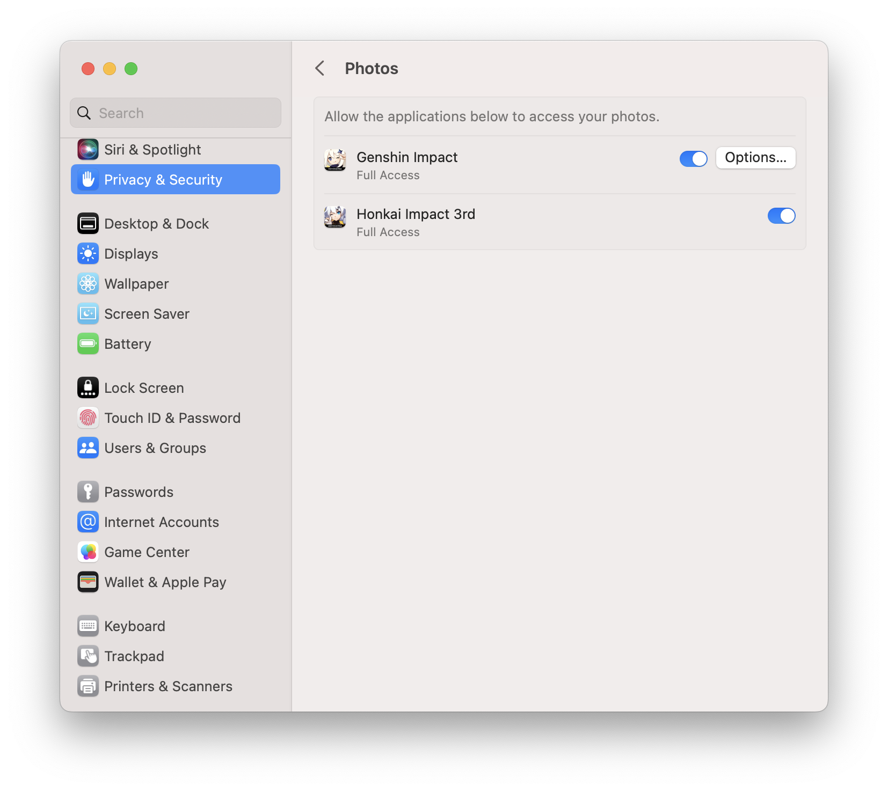

# Photo Storage

PlayCover will save screenshots taken in-game to your Mac's Photo Library. When you take a screenshot in-game for the first time, you will be asked to grant the app permission to access Photos. 

You can manage these permissions in `System Settings` > `Privacy & Security` > `Photos`

###### This information is up-to-date as of PlayCover 2.0.3
