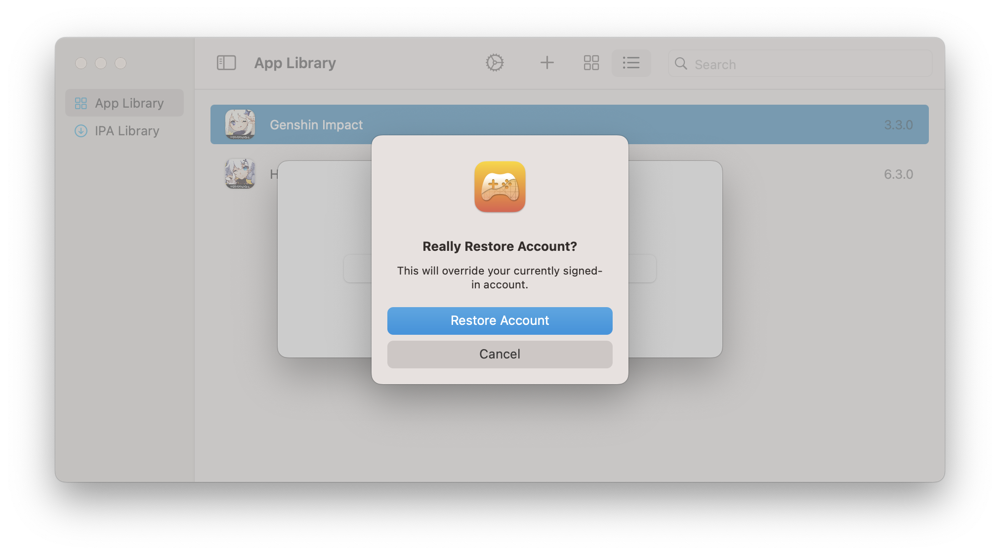

# Account Manager

Account Manager lets you store the login details of an account so you can effortlessly switch between different accounts without the need to disable System Integrity Protection (SIP) every time. **Currently, this feature only works for Genshin Impact.**

## Store Account

You can store multiple accounts to easily switch between them later, this allows you to bypass the inconvenient login process of disabling, modifying boot-args, and re-enabling SIP.

To store an account, right click on Genshin Impact, then click on `Store Account`.

You can choose an account region and enter a name for the account.

## Switch Account

To switch between your stored accounts, right click on Genshin Impact and then select `Switch Account`.

In the selection menu, you can choose an account you have previously stored to switch to.

You can restore an account by clicking on its name, doing so will replace the previous account that you used to sign in. If you have not stored the previous account, you will not be able to easily switch back to it afterwards, and will have to disable SIP and modify boot-args again in order to login to that account.

## Delete Account

To delete accounts you have previously stored, right click on Genshin Impact then select `Delete Account`.

In the selection menu, you can choose an account you have previously stored to delete.

You can delete an account by clicking on its name. If you delete an account, you will not be able to switch back to it afterwards, and will have to disable SIP and modify boot-args again in order to login to that account.

###### This information is up-to-date as of PlayCover 2.0.2
