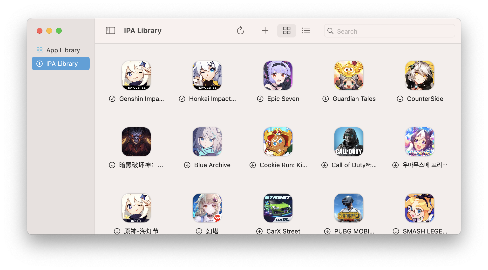

# IPA Library
You can use the IPA Library to install apps from `.ipa` sources you have added.

## Adding Sources

To add a source, click on the **Add source** button to enter a valid source link. 

## Installing Apps 
Installing apps from the IPA Library is easy, simply double click on the app you want to install to add it to your **App Library**.

## Managing Sources
If you want to delete a source, you can use the menu in `Menu Bar` > `PlayCover` > `Settings...` > `IPA Sources`. Here you can also add, move, and refresh sources. A green checkmark means the source URL is valid and working properly.

###### This information is up-to-date as of PlayCover 2.0.3
