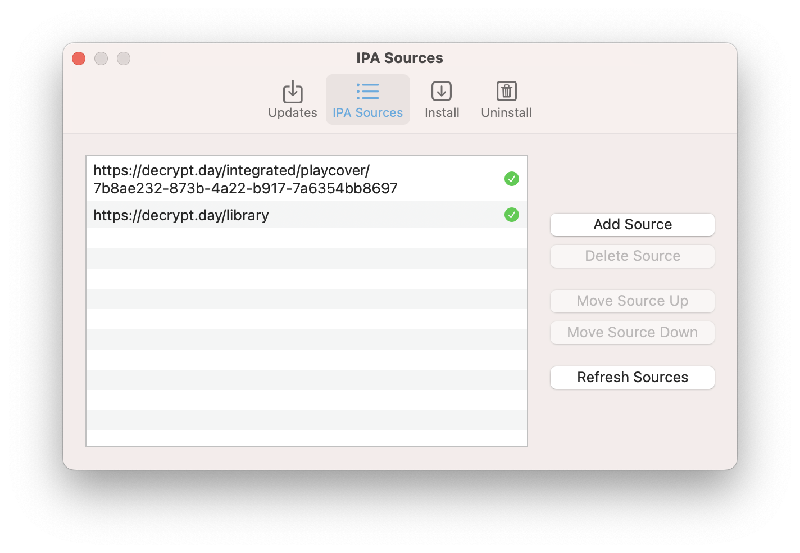
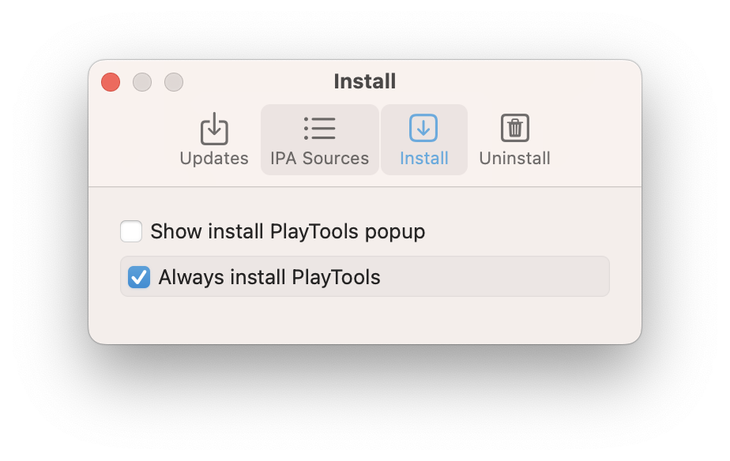

# PlayCover Settings
PlayCover has a few settings you customize to your preference. 

You can find these settings from `Menu Bar` > `PlayCover` > `Settings...`

## PlayCover Updates

You can turn on or off automatic updates or manually check for version updates to the PlayCover app.

## IPA Sources
You can add, delete, move, and refresh sources for your IPA Library. A green checkmark icon indicates the source URL is valid and working properly. 

## Install 
You can choose the default app install behavior to ask you to install PlayTools each time or always install.

## Uninstall 
You can choose the default app uninstall behavior and well as prune files. Prune files will remove all unused files including settings, entitlements, keymappings, and app data.

