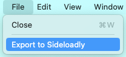

# Sideloadly Export

You may use PlayCover to inject PlayTools to `.ipa` files and directly export them to Sideloadly. This will make keymapping and screen rotation available in Sideloadly signed apps.

Keymaps created for Sideloadly installed apps won't be saved after you exit the app.