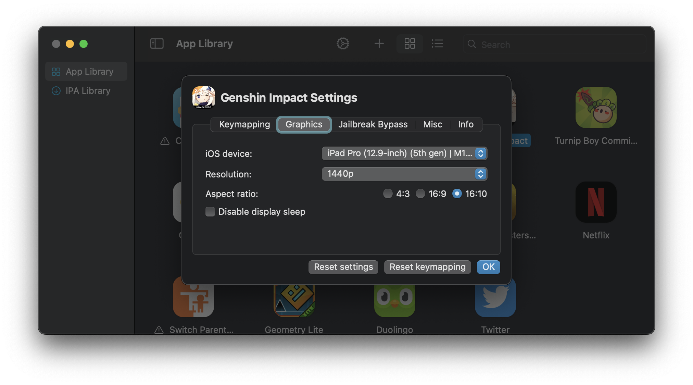

# Graphics

With PlayTools injected, you will be able to change the iOS device and the resolution settings of the app. These settings are only applied when you launch the app and will not take effect while the app is already open.

### iOS Device

This controls the Model Identifier that PlayCover will report to the running app. Essentially this decides what device the app *thinks* it is running on. Apps can have device specific optimisations, so adjusting this value can lock/unlock certain features.

For most applications, iPad identifiers are preferred over iPhone identifiers, however there are a few iPhone options available.

Using the `M1` iPad identifier on MacBook Air will typically result in thermal throttling when playing graphically intensive games (like Genshin Impact) over a long period of time. If thermals are a concern or you want to enjoy longer gaming sessions on MacBook Air without FPS drops, we recommend using the `A12Z` identifier.

For every other Apple Silicon device and most applications, we recommend the `M1` iPad identifier, as this usually provides the best experience.

>__Note__: For most graphically intensive games the `A12Z` identifier will provide a consistent 60fps experience at max graphical settings, but at the cost of image sharpness since the game will be rendered at a lower internal resolution compared to `M1`.

### Resolution

| Option | Description |
| :-----------: | ------------- |
| App Default  | This will leave the window size up to the application, which may not always be desirable since it might not fully utilize the available screen real estate of your display. Some apps may only work correctly under this setting, otherwise their display and touch area might be offset, and in particular cases dynamic window resizing won’t work either. |
| Auto (Based on Display) | This will attempt to match the window size to your display's resolution and aspect ratio. |
| 1080p/1440p/4K | This sets the window size to a standard resolution, with aspect ratio options of 4:3, 16:9, or 16:10. Most MacBook built in displays are 16:10 and we recommend using this aspect ratio to prevent letterboxing. |
| Custom | This lets you set a completely custom resolution, useful for ultrawide monitor setups. Please note that some extreme aspect ratios or resolutions may cause compatibility or performance issues. |

>__Note__: Keymaps do not automatically adjust according to aspect ratio changes. For example, a keymap made for 16:10 will not work properly when the game is changed to 16:9. We recommend using keymaps made specifically for the aspect ratio you choose, you can find them on the [_Keymaps repository_](https://github.com/PlayCover/keymaps/tree/master/keymapping).

### Disable display sleep

This prevents your display from going to sleep while the app is running, which can be helpful for streaming apps like Netflix.

###### This information is up-to-date as of PlayCover `2.0.2`
