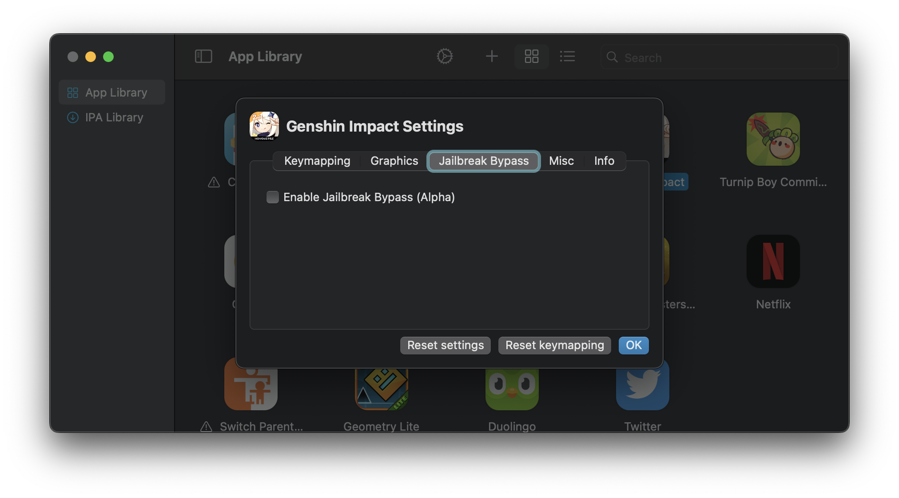

# Jailbreak Bypass

### Enable Jailbreak Bypass (Alpha)

As the option suggests, Jailbreak Bypass is not a catch-all solution, and often requires app-specific customisation. 

This feature attempts to restrict the entitlements of applications such that they are unable to detect certain macOS directories that can be interpreted as running in a jailbroken environment.

Most users should leave this option **disabled**.
