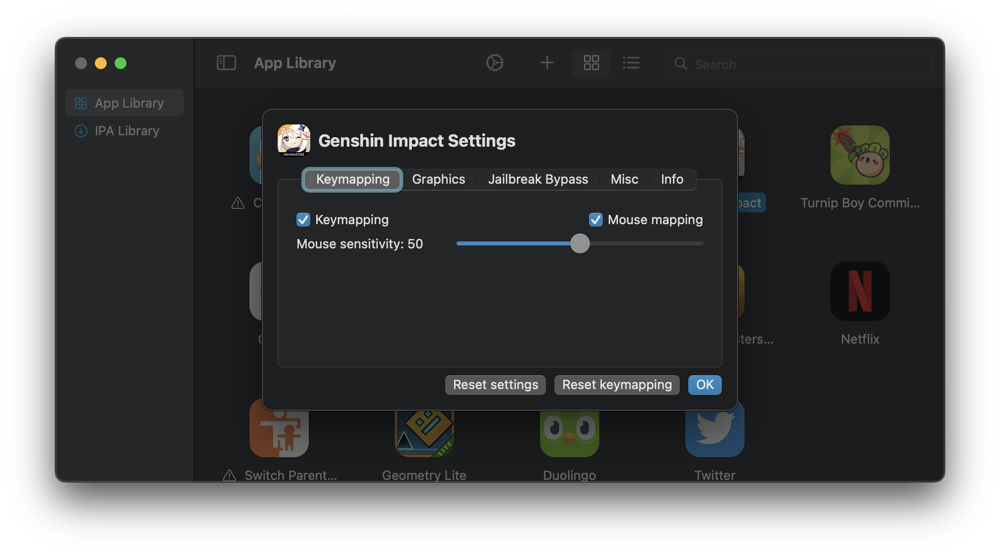

# Keymapping

### Keymapping

This option enables/disables key-bound touch controls within the app.

### Mouse Mapping

This option enables/disables the mouse look control within the app. 

Disabling this while leaving keymapping enabled can be useful for certain apps where having both a free cursor and key-bound controls are necessary.

### Mouse Sensitivity

This adjusts the sensitivity of the mouse look control within the app. The default sensitivity is 50.