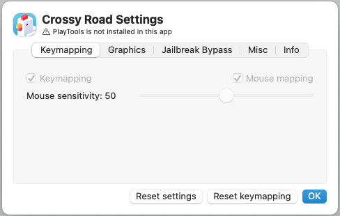

# Miscellaneous

### Enable Discord activity

This option enables/disables Discord RPC, which allows you to display the games you're playing in PlayCover in your Discord status seamlessly. If you wish to further customise the appearence of this status, you can use the `Custom Discord activity` values as shown in the picture below.

### Metal 3 Performance HUD (macOS 13+)

This feature enables the new Metal 3 Performance HUD introduced in macOS Ventura to provide you with frame rate, frame time, GPU, and Memory usage stats. This can be helpful for stress testing the performance of certain games to find the right balance between quality and performance. 

>__Note__: The HUD cannot be enabled or disabled while the game is running. You must enable or disable it from individual app settings in PlayCover while the app is closed. When enabled, the HUD will always show in the top right corner of the app window and cannot be moved.

The following table will provide an in-depth explanation of the HUD based on the image above:

| Example | Description |
| :-----------: | ------------- |
| `Apple M1` | Name of the GPU Device. |
| `[2668x1688]` | Drawable resolution being targeted. |
| `1.9x` | Scaling state of the display. `1.0x` would be native for displays that do not use HiDPI. For displays that use HiDPI, macOS will apply downsampling at `0.5x` to reach actual window resolution, so native resolution would be around `2.0x.` |
| `Composited` | Direct or composited path of the display. The direct path has the least buffering and the fewest number of refresh intervals between the presented drawable and when it appears on the screen. When it is composited, there may be some additional buffering and display latency due to system UI elements or additional layers overlapping the screen. |
| `60Hz` | The maximum refresh rate of the physical display being used. We recommend setting in-game FPS limit to match the refresh rate to prevent screen tearing and frame time stuttering. |
| `FPS: 60.00` | Instantaneous frames per second, the numbers in the brackets indicate min and max values recorded in the last 1.5 seconds of the graph interval, however, FPS is not shown as a line on the graph. |
| `Pre: 16.67` | Pretime/frame time, the amount of time it takes (in milliseconds) to render each frame. The numbers in the brackets indicate min and max values recorded in the last 1.5 seconds of the graph interval. Frame time is shown as a blue line on the graph, a flat line indicates consistent frame time. |
| `GPU: 10.97` | The amount of GPU work completed in the frame interval, also measured in milliseconds. The numbers in the brackets indicate min and max values recorded in the last 1.5 seconds of the graph interval. GPU utilization is shown as a green line on the graph. |
| `Mem: 1.57GB` | Process memory usage, the green numbers in brackets indicates GPU memory consumption. |

##### Source: [Discover Metal Performance HUD (Apple Developer)](https://developer.apple.com/videos/play/tech-talks/110339/)

### Debugger

This feature is meant for development and testing purposes only, and should not be enabled unless you know what you are doing.

### Inject/Remove PlayTools

By default, PlayTools are injected into the app when you add it to the App Library. PlayTools allows you to use keymapping, mouse mapping, change iOS device identifier, set custom resolutions, and more. However, these features may not be necessary for certain apps and may even cause issues. If the app you are using is not working properly as expected, you can try removing PlayTools.

If an app doesn't have PlayTools, it will show with a warning sign alongside its name.

 

###### This information is up-to-date as of PlayCover `2.0.4`
