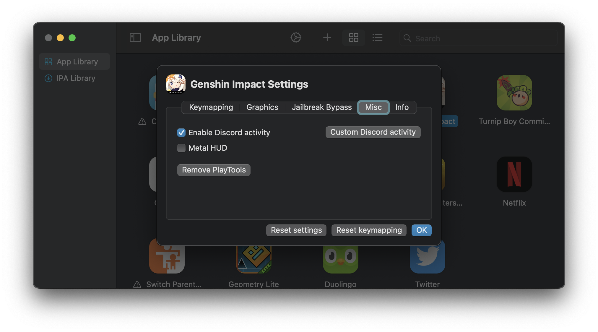
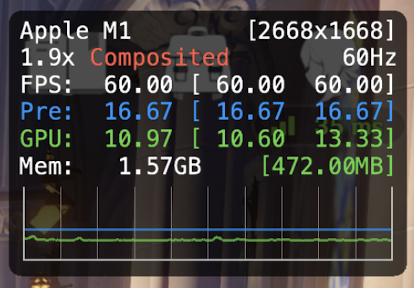

# Miscellaneous

### Enable Discord activity

This option enables/disables Discord RPC, which allows you to display the games you're playing in PlayCover in your Discord status seamlessly. If you wish to further customise the appearence of this status, you can use the `Custom Discord activity` values.

### Metal 3 Performance HUD (macOS 13+)

This feature utilises the new Metal 3 Performance HUD in macOS Ventura to provide you with frame rate, frame time, GPU, and Memory utilisation stats. This can be useful for stress testing the performance of games to find the right balance between quality and performance. 

>__Note__: To show or hide the HUD in-game, you must toggle it from individual app settings in PlayCover while the app is closed. When enabled, the HUD will always show in the top right corner of the window and may obscure some of the content rendered by the app in this area.

The following table will provide an in-depth explanation on the Metal 3 Performance HUD:

| Example | Description |
| :-----------: | ------------- |
| `Apple M1` | Shows the name of the Apple Silicon chip. |
| `[2668x1688]` | Effective window resolution. |
| `1.9x` | Resolution scaling performed by macOS. `1.0x` would be native for displays that do not use HiDPI. For displays that use HiDPI, macOS will apply downsampling at `0.5x` to reach actual window resolution, so native resolution would be around `2.0x.` |
| `Composited` | How the app is rendered to display, can be `Composited` or `Direct`. |
| `60Hz` | The refresh rate limit supported by your display hardware. We recommend setting in-game FPS limit to match the refresh rate to prevent screen tearing and frame time stuttering. |
| `FPS: 60.00` | Average frames per second, the numbers in the brackets indicate min and max values recorded in the interval of the graph, however, FPS is not shown as a line on the graph. This number should be equal to the supported refresh rate of your display during gameplay. |
| `Pre: 16.67` | Average frame time, or the amount of time it takes (in milliseconds) to render each frame. The numbers in the brackets indicate min and max values recorded in the interval of the graph. Frame time is shown as a blue line on the graph, a flat line indicates consistent frame time. |
| `GPU: 10.97` | Average GPU utilization (not percentage based), the numbers in the brackets indicate min and max values recorded in the interval of the graph. GPU utilization is shown as a green line on the graph. GPU usage may fluctuate during gameplay, this is normal as long as FPS and frame time are consistent. |
| `Mem: 1.57GB` | Average RAM usage, the green numbers in brackets indicates VRAM usage. |

### Debugger

This feature is meant for development and testing purposes only, and should not be enabled unless you know what you are doing.

###### This information is up-to-date as of PlayCover `2.0.2`
